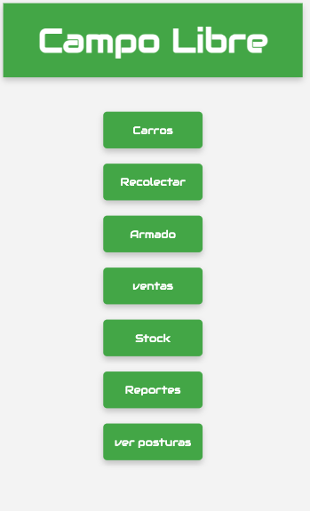
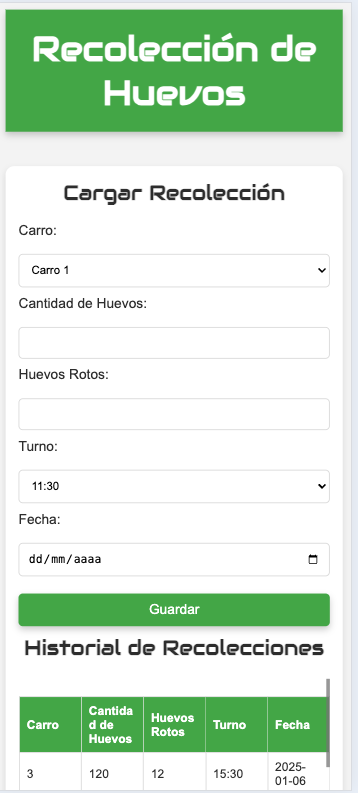
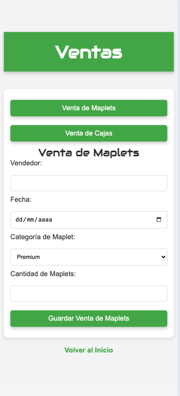
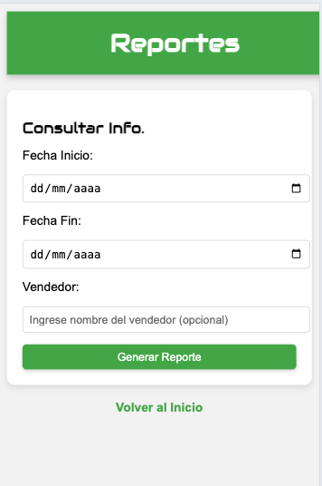
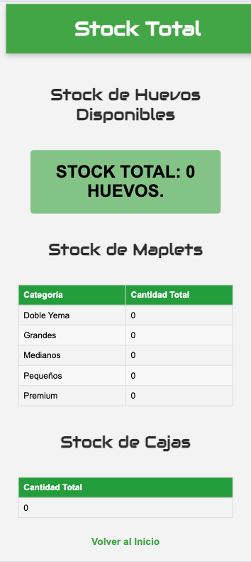
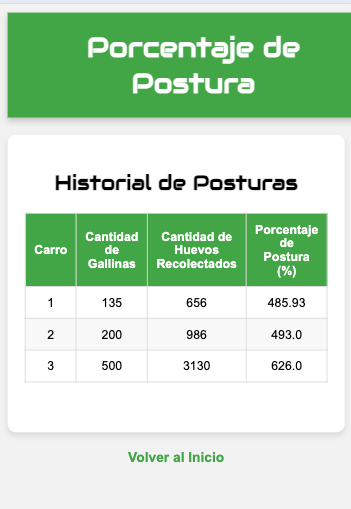
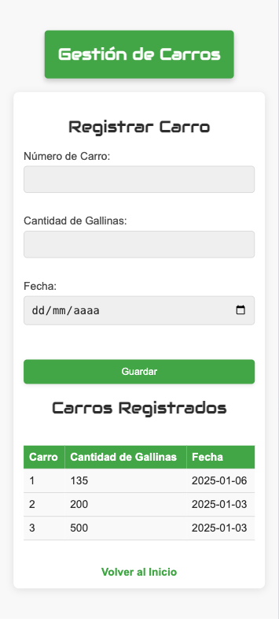

# Campo Libre

Campo Libre es una aplicación web desarrollada en Flask que permite gestionar el stock, ventas y recolecciones de productos de manera eficiente. La aplicación está diseñada para ser fácil de usar y funciona tanto en entornos locales como en servidores de producción como PythonAnywhere.

## Índice

- [Características](#características)
- [Tecnologías Utilizadas](#tecnologías-utilizadas)
- [Requisitos Previos](#requisitos-previos)
- [Instalación Local](#instalación-local)
- [Despliegue en PythonAnywhere](#despliegue-en-pythonanywhere)
- [Capturas de Pantalla](#capturas-de-pantalla)
- [Autor](#autor)

## Características

- Gestión de recolecciones.
- Gestión de ventas con cálculo automático de maplets y cajas.
- Gráficos de distribución de ventas.
- Resumen de stock por categoría.
- Filtros avanzados por fecha, vendedor y categoría.
- Exportación de datos a Excel.
- Diseño responsivo para uso en dispositivos móviles.

## Tecnologías Utilizadas

- **Backend**: Python (Flask)
- **Frontend**: HTML, CSS, Bootstrap, Matplotlib
- **Base de Datos**: SQLite
- **Entorno de Producción**: PythonAnywhere
- **Librerías Adicionales**:
  - `flask`
  - `matplotlib`
  - `openpyxl`
  - `pandas`

## Requisitos Previos

- Python 3.7 o superior instalado.
- Entorno virtual configurado (opcional, pero recomendado).
- Conexión a Internet para instalar dependencias y descargar recursos.

## Instalación Local

1. Clona el repositorio:
   ```bash
   git clone https://github.com/tu_usuario/campo-libre.git
   cd campo-libre
   ```

2. Crea y activa un entorno virtual:
   ```bash
   python3 -m venv venv
   source venv/bin/activate  # En Windows: venv\Scripts\activate
   ```

3. Instala las dependencias:
   ```bash
   pip install -r requirements.txt
   ```

4. Configura la base de datos:
   ```bash
   sqlite3 campo_libre.db < schema.sql
   ```

5. Ejecuta la aplicación:
   ```bash
   python app.py
   ```

6. Abre la aplicación en tu navegador:
   ```
   http://127.0.0.1:5000
   ```

## Despliegue en PythonAnywhere

1. Sube los archivos del proyecto a tu cuenta de PythonAnywhere.
2. Configura el archivo `wsgi.py` con la ruta correcta de tu aplicación.
3. Instala las dependencias en el servidor:
   ```bash
   pip install -r requirements.txt
   ```
4. Verifica que la base de datos (`campo_libre.db`) esté correctamente configurada.
5. Reinicia el servidor web en PythonAnywhere.
6. Accede a tu aplicación desde el dominio proporcionado por PythonAnywhere.

## Capturas de Pantalla

### Pantalla de Inicio


### Pantalla de Recolecciones


### Pantalla de Ventas


### Pantalla de Reportes



### Pantalla de Resumen de Stock


### Otras pantallas







## Autor

**Diego Bruno**  
Programador en Python y Flask, especializado en el desarrollo de aplicaciones web y bots automatizados.  


